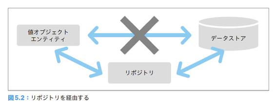
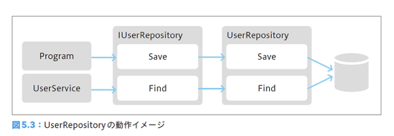

# ボトムアップで分かる！ドメイン駆動設計の基本 Chap.5

〜データにまつわる処理を分離する「リポジトリ」〜
2021/12/02

---

## 今回学ぶこと

- ロジックが特定のインフラストラクチャ技術に依存することは処理の目的をぼやけさせる
- リポジトリを利用するとデータの永続化にまつわる処理を抽象化できる
- リポジトリを活用してドメインのルールに際立たせることは開発者の助けとなる

---

## この章の概要

1. リポジトリとは
2. リポジトリの責務
3. リポジトリのインターフェース
4. SQL を利用したリポジトリを作成する
5. テストによる確認
6. テスト用のリポジトリを作成する
7. オブジェクトリレーショナルマッパーを用いる
8. リポジトリに定義されるふるまい
9. まとめ

---

<style scoped>
  section { font-size: 160%; }
</style>

## 前回のおさらい

- ドメインサービスによって不自然さを解決できるようになった！
- データストアの操作が入り込み、柔軟性に乏しいコードとなってしまった・・・

```cs
class UserService
{
  public bool Exists(User user)
  {
    var connectionString = ConfigurationManager.ConnectionStrings["FooConnection"].ConnectionString;
    using (var connection = newSqlConnection(connectionString))
    using (var command = connection.CreateCommand())
    {
      connection.Open();
      command.CommandText = "SELECT * FROM users WHERE name = @name";
      command.Parameters.Add(newSqlParameter("@name", user.Name.Value));
      using (var reader = command.ExecuteReader())
      {
        var exist = reader.Read();
        return exist;
      }
    }
  }
}
```

---

<style scoped>
  section { font-size: 170%; }
</style>

## 5.1 リポジトリとは

- リポジトリという言葉の一般的な意味は保管庫
  - ソフトウェア開発の文脈でも同じ。データの保管庫
- オブジェクトのインスタンスを保存したいときは直接 DB に書き込むのではなく、リポジトリに永続化を依頼する
  - リポジトリを経由して行うだけで、ソフトウェアに驚くほどの柔軟性を与える



---

### COLUMN リポジトリはドメインオブジェクトを際立たせる

- リポジトリはドメインオブジェクトとは異なり、ドメインの概念を由来とするものではない
  - しかしドメインと無関係ではない
- プログラムを組む上で技術的要素を由来とする手の込んだコードは不可避
  - リポジトリはそういったコードを引き受け、ドメインオブジェクトを際立たせる
  - ドメイン設計の構成要素として欠かせない存在！

---

## 5.2 リポジトリの責務

- リポジトリの責務はドメインオブジェクトの永続化や再構築を行うこと
  - 永続化先の種類は問わない（Oracle, MySQL, DynamoDB...）
  - オブジェクトの永続化にまつわる処理をリポジトリという抽象的なオブジェクトに任せることで、ビジネスロジックはより純粋なものに昇華される！
- まずはリポジトリを使わない場合はどうなるかを見てみる

---

#### 第４章で登場したユーザー作成処理

```cs
class Program
{
  public void CreateUser(string userName)
  {
    var user = new User(
      new UserName(userName)
    );

    var userService = new UserService();
    if (UserService.Exists(user))
    {
      throw new Exception($"{userName}は既に存在しています");
    }

    var connectionString = ConfigurationManager.ConnectionStrings["FooConnection"].ConnectionString;
    using (var connection = newSqlConnection(connectionString))
    using (var command = connection.CreateCommand())
    {
      connection.Open();
      command.CommandText = "INSERT INTO users (id, name) VALUES(@id, @name)";
      command.Parameters.Add(newSqlParameter("@id", user.Id.Value));
      command.Parameters.Add(newSqlParameter("@name", user.Name.Value));
      command.ExecuteNonQuery();
    }
  }
}
```

---

#### UserService の処理内容

```cs
class UserService
{
  public bool Exists(User user)
  {
    var connectionString = ConfigurationManager.ConnectionStrings["FooConnection"].ConnectionString;
    using (var connection = newSqlConnection(connectionString))
    using (var command = connection.CreateCommand())
    {
      connection.Open();
      command.CommandText = "SELECT * FROM users WHERE name = @name";
      command.Parameters.Add(newSqlParameter("@name", user.Name.Value));
      using (var reader = command.ExecuteReader())
      {
        var exist = reader.Read();
        return exist;
      }
    }
  }
}
```

---

#### リポジトリを使わないと・・・

- コードの大半はデータストアの具体的な操作に追われてしまっているため、趣旨が読み取りづらい
  - コードを詳しく読み込まないと User オブジェクトのインスタンスを保存していることが分からない
  - ユーザーの重複が何をもって判断されるかはクエリを確認しないと分からない
- リポジトリを利用する場合はどうなるかを見てみる

---

#### リポジトリを利用したユーザー作成処理

```cs
class Program
{
  private IUserRepository userRepository;

  public Program(IUserRepository userRepository)
  {
    this.userRepository = userRepository;
  }
  public void CreateUser(string userName)
  {
    var user = new User(
      new UserName(userName)
    );

    var userService = new UserService();
    if (UserService.Exists(user))
    {
      throw new Exception($"{userName}は既に存在しています");
    }
    userRepository.Save(user);
  }
}
```

---

#### リポジトリを利用したドメインサービス

```cs
class UserService
{
  private IUserRepository userRepository;

  public UserService(IUserRepository userRepository)
  {
    this.userRepository = userRepository;
  }
  public bool Exists(User user)
  {
    var found = userRepository.Find(user.Name);
    return found != null;
  }
}
```

---

#### リポジトリを使うと・・・

- オブジェクトの永続化はリポジトリである IFooRepository オブジェクトに対して依頼されるようになる
  - データストアが RDB なのか NoSQL なのかは隠蔽される
  - 重要なことはインスタンスを何らかの手段によって保存するということ
  - 具体的なデータストアにまつわる処理から解放され、ビジネスロジックが純粋なものに昇華された！

---

## 5.3 リポジトリのインターフェース

```cs
public interface IUserRepository
{
  void Save(User user);

  User Find(UserName name);
}
```

- インスタンスを保存するためのふるまいとユーザ名によるインスタンスの復元を提供している
- 再構築時に対象オブジェクトが見つからなかった場合は null を返却している

---

#### COLUMN null の是非と Option 型

- null は人類が取り扱うには難しい概念
- null によるバグを起こさないためには null を扱わないことが一番
  - null が存在しないプログラミング言語もある
    - デフォルトで Null Safety なのは Kotlin, Rust, Dart, Swift, etc...
    - TypeScript も `--strictNullChecks` を有効にするとコンパイラがチェックしてくれる
  - Option(al)型がサポートされている場合はそれを利用する
    - 戻り値が存在することもあればしないこともあるという型
      - `Option<User> Find(UserName name);`

---

## 5.4 SQL を利用したリポジトリを作成する

---

#### SQL を利用したリポジトリ（Save メソッド）

```cs
public class UserRepository : IUserRepository
{
  private string connectionString = ConfigurationManager.ConnectionStrings["DefaultConnection"].ConnectionString;

  public void Save(User user)
  {
    using (var connection = newSqlConnection(connectionString))
    using (var command = connection.CreateCommand())
    {
      connection.Open();
      command.CommandText = @"
        MERGE INTO users
          USING (
            SELECT @id AS id, @name AS name
          ) AS data
          ON users.id = data.id
          WHEN MATCHED THEN
            UPDATE SET name = data.name;
          WHEN NOT MATCHED THEN
            INSERT (id, name) VALUES (data.id, data.name);
      ";
      command.Parameters.Add(newSqlParameter("@id", user.Id.Value));
      command.Parameters.Add(newSqlParameter("@name", user.Name.Value));
      command.ExecuteNonQuery();
    }
  }
  (...略...)
}
```

---

#### SQL を利用したリポジトリ（Find メソッド）

```cs
public class UserRepository : IUserRepository
{
  (...略...)

  public void Find(UserName userName)
  {
    using (var connection = newSqlConnection(connectionString))
    using (var command = connection.CreateCommand())
    {
      connection.Open();
      command.CommandText = "SELECT * FROM users WHERE name = @name";
      command.Parameters.Add(newSqlParameter("@name", user.Name.Value));
      using (var reader = command.ExecuteReader())
      {
        if (reader.Read())
        {
          var id = reader["id"] as string;
          var name = reader["name"] as string;
          return new User(
            new UserId(id),
            new UserName(name)
          );
        }
        else
        {
          return null;
        }
      }
    }
  }
}
```

---

#### 呼び出し側はどうなるかというと・・・

```cs
var userRepository = new UserRepository();
var program = new Program(userRepository);
program.CreateUser("alice");
```

- 処理の流れがとてもわかりやすい！

---

#### Repository の動作イメージ

- Program クラスは IUserRepository を扱うが、その実態は UserRepository
- 呼び出し側のクラスが直接具象クラスを扱わずインターフェースという抽象クラスを挟むことで、呼び出し側では具体的な永続化にまつわる処理を記述せずにデータストアにアクセスできるようになる
  

---

## 5.5 テストによる確認

- テストは次のことに寄与する
  - プログラムが常に開発者の意図通りに動作しているかの確認
  - ソフトウェアの柔軟性の担保（変更容易性）
- ドメインの変化を受けてソフトウェアが変化するためにはテストを用意することが重要

---

### 5.5.1 テストに必要な作業を確認する

- ユーザー作成処理の動作確認テストをするためには以下が必要
  - リレーショナルデータベースの用意
  - 接続文字列の設定
  - 問い合わせ先となるテーブルの用意
  - テーブル作成のためのカラムの定義
  - テストケースの要件に沿ったデータの投入
    - テーブル準備やデータ投入はテストごとに必要になることも

---

### 5.5.2 祈り信者のテスト理論

<style scoped>
  section { font-size: 180%; }
</style>

- テストを行うための手間が多いと開発者はテストを敬遠するようになる
- テストをしなかったコードに対して開発者にできることは祈りを捧げることだけ


---

### 5.5.3 祈りを捨てよう

- 祈りを捨てさせ、テストをするように駆り立てる方法は２つ
  - 恐怖による統制を行う
  - 効率的にテストが行えるようにする（開発者ならこっち）
    - DB を利用しないようにすればいい
    - DB に依存しないテスト用のリポジトリを利用する

---

## 5.6 テスト用のリポジトリを作成する

- メモリにインスタンスを保存することで、DB の代用とする
- DB に接続する必要がなくなるだけで、テストは驚くほど気軽に行えるようになる

---

## 5.7 オブジェクトリレーショナルマッパーを用いたリポジトリを作成する

<style scoped>
  section { font-size: 180%; }
</style>

- 昨今では直接 SQL 文をコード上で組み立てて実行せず、ORM を利用する方法がメジャー
  - 言語依存・・・C#: EntityFramework, Java: Hibernate, ...
  - DB 依存・・・DynamoDB: DynamoDB DataMapper, Dynamoose, ...
- ORM のメリット
  - SQL を書かなくてよい
  - オブジェクト指向型言語で書ける
  - DB への処理がカプセル化されている

---

```cs
public class EFUserRepository : IUserRepository
{
  private readonly MyDbContext context;
  public EFUserRepository(MyDbContext context)
  { this.context = context; }
  public User Find(UserName name)
  {
    var target = context.Users.FirstOrDefault(userData => userData.Name == name.Value);
    if (target == null) { return null; }
    return ToModel(target);
  }
  public void Save(User user)
  {
    var found = context.Users.Find(user.Id.Value);
    if (found == null)
    {
      var data = ToDataModel(user);
      context.Users.Add(data);
    }
    else
    {
      var data = Transfer(user, found);
      context.Users.Update(data);
    }
    context.SaveChanges();
  }
```

---

```cs
  private User ToModel(UserDataModel from)
  {
    return new User(
      new UserId(from.Id), new UserName(from.Name)
      );
  }
  private UserDataModel Transfer(User from, UserDataModel model)
  {
    model.Id = from.Id.Value;
    model.Name = from.Name.Value;
    return model;
  }
  private UserDataModel ToDataModel(User from)
  {
    return new UserDataModel
    {
      Id = from.Id.Value,
      Name = from.Name.Value,
    };
  }
}
```

---

- リポジトリのおかげで、変わったのはリポジトリの実態だけ
- Program クラスがインスタンス化された以降の処理はインメモリのリポジトリを使ったテストとまったく同じ

```cs
var userRepository = new EFUserRepository(myContext);
var program = new Program(userRepository);

program.CreateUser("naruse");

//データを取り出して確認
var head = myContext.Users.First();
Assert.AreEqual("naruse", head.Name);
```

---

## 5.8 リポジトリに定義されるふるまい

---

### 5.8.1 永続化に関するふるまい

- 永続化を行うオブジェクトを引数にとる
  - 対象の識別子と特定の更新項目を引き渡すメソッドは用意しない
- オブジェクトを作成する処理もリポジトリには定義しない
  - 第９章で紹介する「ファクトリ」で行う
- 破棄に関するふるまいもある

---

### 5.8.2 再構築に関するふるまい

- もっとも頻繁に利用されるのは識別子によって検索されるメソッド
- 重複確認などを行いたい場合には全件取得メソッドを定義
  - ただしコンピュータのリソースを食いつぶす可能性があるので注意
  - 探索を定義する際にはそれに適したメソッドを定義

---

## 5.9 まとめ

- ロジックが特定のインフラストラクチャ技術に依存することは処理の目的をぼやけさせる
- リポジトリを利用するとデータの永続化にまつわる処理を抽象化できる
- リポジトリを活用してドメインのルールに際立たせることは開発者の助けとなる

---

<style scoped>
  section { font-size: 190%; }
</style>

## 余談：Repository と DAO の違い

> リポジトリは、データベースを操作するため、従来の DAO（データアクセスオブジェクト）と似ているかもしれません。しかし、DAO がデータ中心指向であるのに対して、リポジトリはオブジェクト指向アプローチである点で異なります。
> そのため、DDD としては「ドメインモデル」＋「リポジトリ」＋「データマッパー（Hibernate 等）」との相性が良く、逆に DAO では「トランザクションスクリプト」＋「テーブルモジュール」または「テーブルデータゲートウェイ」または「アクティブレコード」との相性が良いと IDDD 本では紹介されています。

参考：[実践 DDD 本 第 12 章「リポジトリ」～集約の永続化管理を担当～](https://codezine.jp/article/detail/11048)

---

## Fin.
